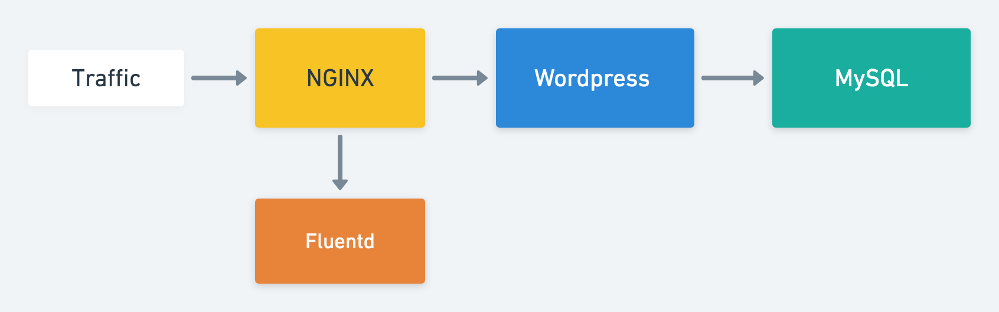

# Deployment, DaemonSet, StatefulSet, Job, CronJob

* 請參考 k8s-object 資料夾

# Team Work



## 活動 1
請依照今日所學嘗試和隊友討論心目中可能方案

1. 架構圖 with kubernetes objects
2. 設計原因
   
完成後會抽出一組上台介紹，並由各組提問

---

# MySQL

1. Image: `mysql:5.6`
2. Reference: https://hub.docker.com/_/mysql
3. Environment Variable
   * `MYSQL_ROOT_PASSWORD`
   * `MYSQL_DATABASE`
   * `MYSQL_USER`
   * `MYSQL_PASSWORD`

# WordPress

1. Image: `wordpress:latest`
2. Reference: https://hub.docker.com/_/wordpress/
3. Environment Variable
   * `WORDPRESS_DB_HOST`
   * `WORDPRESS_DB_USER`
   * `WORDPRESS_DB_PASSWORD`
   * `WORDPRESS_DB_NAME`

# Custom NGINX

1. Image: `srcmeshcourse/nginx-log-path:0.1`
2. Environment Variable 
   * `POD_NAME`: 可以透過 Downward API 傳入容器
        (透過傳入 `POD_NAME` 可以修改 access.log 與 error.log 的存放位置。
        從 `/var/log/nginx/access.log` 變成 `/var/log/nginx/<pod>/access.log`)

# Custom Fluentd

1. Image: `srcmeshcourse/fluentd-tail:0.1`

使用 Custom Fluentd + NGINX 的範例

```yaml
apiVersion: v1
kind: Pod
metadata:
  name: nginx-pod
  labels:
    app: nginx
    backend: python
spec:
  containers:
  - image: srcmeshcourse/nginx-log-path:0.1
    name: nginx
    env:
    - name: POD_NAME
      valueFrom:
        fieldRef:
          fieldPath: metadata.name
    ports:
      - containerPort: 80
        protocol: TCP
    volumeMounts:
    - mountPath: /var/log/nginx/
      name: log-volume
  - image: srcmeshcourse/fluentd-tail:0.1
    name: fluentd
    volumeMounts:
    - mountPath: /var/log/
      name: log-volume
  volumes:
  - name: log-volume
    emptyDir: {}
```